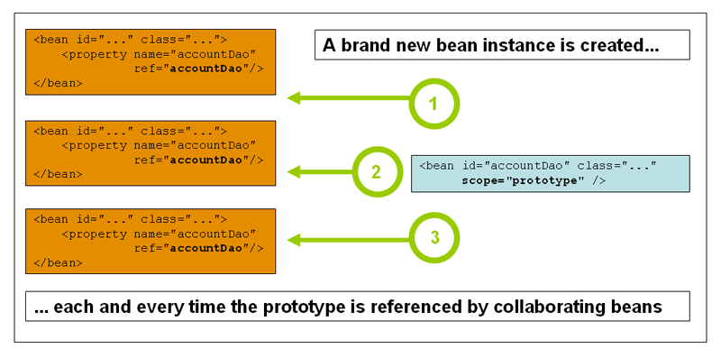

# DI 구현하기

해당 레포지토리는 우아한 테크코스 코치인 구구의 [di-study](https://github.com/kang-hyungu/di-study) 레포지토리를
자바로 변환한 내용이다.

하단 내용부터 구구가 작성한 내용이다.

---

## 준비 사항

- ~~IntelliJ에 Kotest 플러그인 설치~~ (Java 이므로 생략)

## 학습 테스트

스프링 IoC 컨테이너에 대해 좀 더 자세히 알아봅시다.
학습 테스트는 ioc 패키지 또는 클래스 단위로 실행하세요.

1. [스프링 IoC 컨테이너와 Bean 소개](src/test/java/ioc/Introduction.java)
2. [컨테이너 개요](src/test/java/ioc/Container.java)
3. [Bean 개요](src/test/java/ioc/Bean.java)
4. [의존성(Dependencies)](src/test/java/ioc/Dependencies.java)
5. [Bean 스코프](src/test/java/ioc/BeanScopes.java)
6. [Bean의 라이프 사이클](src/test/java/ioc/Lifecycle.java)
7. ~~[어노테이션 기반 컨테이너 구성](src/test/kotlin/ioc/AnnotationBasedConfiguration.kt)~~
8. ~~[자바 기반 컨테이 구성](src/test/kotlin/ioc/JavaBasedConfiguration.kt)~~

### 싱글톤 스코프

### 프로토타입 스코프

